<div align="center">

  <!-- Theme-aware Header Banner -->
  <picture>
    <source media="(prefers-color-scheme: dark)" srcset="./dark.svg">
    <source media="(prefers-color-scheme: light)" srcset="./light.svg">
    
  </picture>

  <br />

  <!-- Social & Tech Badges -->
  <p align="center">
    <a href="https://github.com/Kishordwngn">
      
    </a>
    <a href="https://www.linkedin.com/in/kishordwngn">
      
    </a>
    <a href="https://github.com/Kishordwngn/Linkhub">
      
    </a>
  </p>

</div>

---

### 🚀 About Me

I am a final-year Computer Science & Engineering student at **Shri Shankaracharya Technical Campus (SSTC), Bhilai** ('26 Batch). 

Driven by an enterprise engineering mindset, I focus on building high-performance, real-time distributed systems, full-stack web applications, and security tooling. My engineering philosophy combines technical logic with **behavioral psychology & mentalism**, enabling me to design intuitive, user-centric systems.

* 🎓 **Education:** B.Tech in Computer Science & Engineering @ SSTC, Bhilai (2022 - 2026)
* ⚡ **Core Focus:** Real-time Distributed Systems, Backend Architecture, Modern Full-Stack Engineering
* 🔒 **Security Interest:** Cybersecurity & LSB Steganography algorithms
* 🧠 **Fun Fact:** Mentalist & Psychology Enthusiast 🃏

---

### 🛠️ Tech Stack & Tooling

```text
  Languages       :: Python, JavaScript, HTML5, CSS3
  Backend         :: Flask, REST APIs, WebSockets, Socket.io
  Security/Algos  :: Image Steganography, LSB Algorithm
  Developer Tools :: Git, GitHub, VS Code, Linux/Bash
